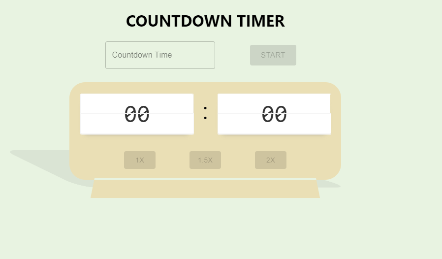
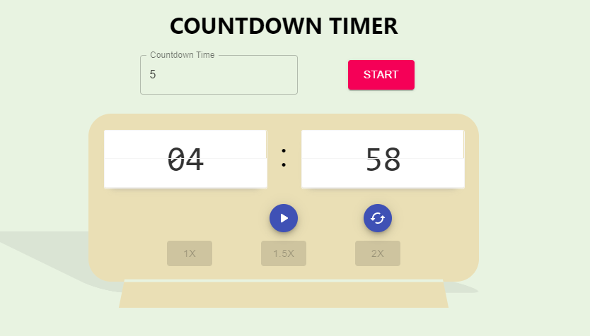
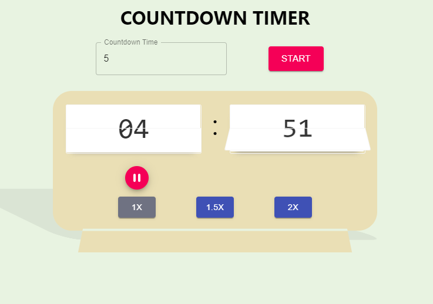
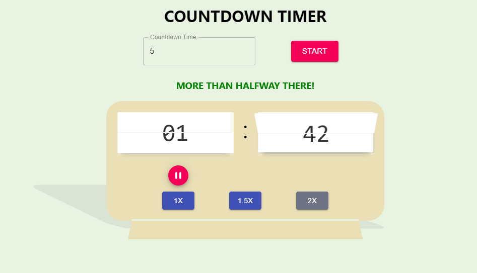
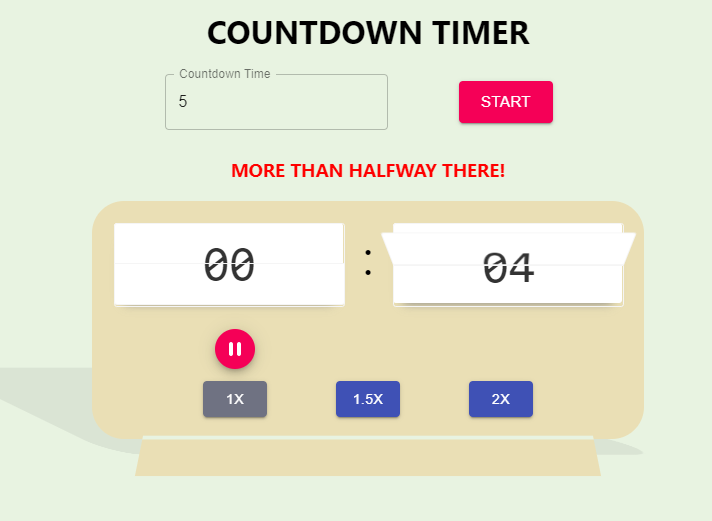
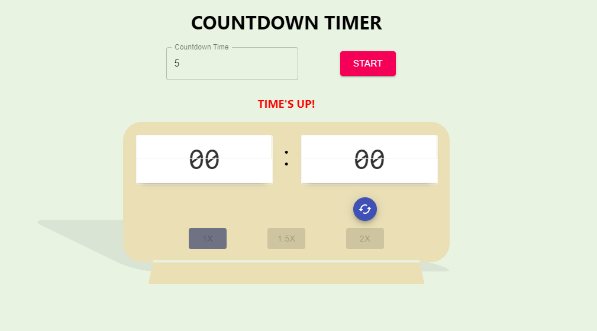

Countdown Timer using Create-React-app

The Following are images of the process at different stages

Project is active here [Countdown](https://varfaj-react-countdown.netlify.app/)

On page load:

    

Countdown start and buttons:

    

    

Countdown messages, and warning:

    

    

    

